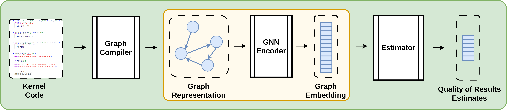

# Balor


This is the codebase for my ICCAD'24 publication "Balor: HLS Source Code Evaluator Based on Custom Graphs and Hierarchical GNNs". Balor was designed to facilitate design space exploration for high-level synthesis, using graph neural networks to estimate the Quality of Results quickly and accurately.

### Methodology

Balor uses a custom graph compiler, built using [ROSE](https://github.com/rose-compiler/rose), which is tailored to both graph neural networks and the HLS process. It uses hierarchical graph neural networks to convert graph representations to graph embeddings, and then passes them to feed-forward neural networks for the actual QoR estimation.




### Balorgnn

The "balorgnn" folder contains all code relating to the GNN encoder and QoR estimators. 

It contains a "requirements.txt" for installing required python depencies. Pytorch Geometric and its dependencies are not included in "requirements.txt" as I find it's easier to directly follow their [installation instructions](https://pytorch-geometric.readthedocs.io/en/latest/install/installation.html).


Balorgnn is built to work as a local python library, and so contains a setup.py and a duplicate balorgnn folder. Like all local python libraries, it can be added to a python enviroment with:
```
pip install -e .
```

The generate/generate_dataset.py script converts c++ files to pytorch geometric .pth files, with support for 4 different datasets. (TODO: Individual instructions for each dataset)

The train/train.py script trains the GNN encoders and estimators, and performs inference on a validate and test set every 10 epochs.

### Graph Compiler

The "graph_compiler" folder contains all of the code for converting c++ code to graph representations, encoded the DOT graph description language from the Graphviz project. To compile it, you will need to first build [ROSE](https://github.com/rose-compiler/rose) [0.11.145.3](https://github.com/rose-compiler/rose/commit/102bc598b74b00a657510f763dabbfb18ed8bdb9) with [Boost](https://www.boost.org/) 1.67.0.

Once built, the wrapper script run_graph_compiler.py allows quick use of the compiler without specifying individual settings.
